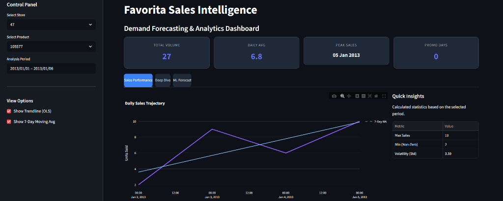
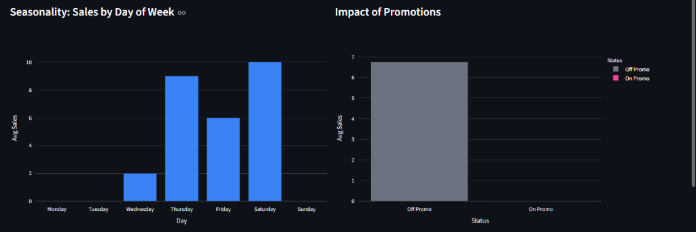
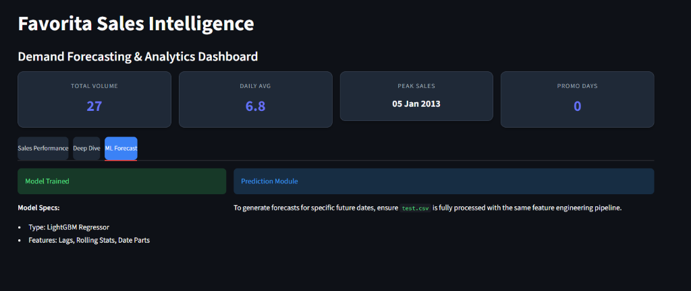

# Grocery Sales Forecasting

## Project Overview

This project focuses on **time-series sales forecasting** using the _Corporación Favorita Grocery Sales_ dataset from Kaggle. The goal is to predict future unit sales for grocery items across different stores using historical sales data, calendar information, promotions, oil prices, and store/item metadata.

This project demonstrates **real-world forecasting**, advanced **feature engineering**, and **regression modeling**, making it highly relevant for data science and ML internship roles.

**Live Demo:** [Streamlit App Link - CLICK HERE](https://demand-forecasting-with-inventory-optimization-bv6cmeua96qzxnm.streamlit.app/)

---

## Dashboard Demo

### 1. Sales Performance Overview

Visualize historical sales trends, 7-day moving averages, and key KPIs.


### 2. Deep Dive Analytics

Analyze seasonality (Day of Week) and the impact of promotions on sales volume.


### 3. Machine Learning Forecast

View model specifications and prepare for future sales predictions.


---

## Dataset

- **Source:** Kaggle – Favorita Grocery Sales Forecasting
- **Key Files Used:**
  - `train.csv` – historical sales data
  - `test.csv` – future dates for prediction
  - `stores.csv` – store metadata
  - `items.csv` – item metadata
  - `oil.csv` – daily oil prices
  - `holidays_events.csv` – holidays and events

---

## Exploratory Data Analysis (EDA)

- Sales trends over time (daily, weekly, monthly)
- Store-wise and item-family-wise sales behavior
- Impact of promotions (`onpromotion`)
- Missing value analysis (oil prices, holidays)

---

## Feature Engineering

To capture time-series patterns and seasonality, the following features were created:

- **Lag Features:** lag_7, lag_14, lag_28
- **Rolling Statistics:** rolling_mean_7, rolling_mean_14, rolling_std_14
- **Calendar Features:** month, day_of_week, week_of_year, is_month_start, is_month_end
- **Promotional Features:** onpromotion flag
- **Encoded Features:** store type, item family

---

## Models Used

- **Random Forest Regressor** (baseline)
- **XGBoost Regressor**
- **LightGBM Regressor** (final selected model)

Time-series–aware validation was used to prevent data leakage.

---

## Evaluation Metrics

- **RMSE (Root Mean Squared Error)** – primary metric
- **MAE (Mean Absolute Error)** – secondary metric

The best-performing model was selected based on validation RMSE.

---

## Results

- Trained a robust forecasting model capturing seasonality and promotional effects
- Generated predictions for Kaggle test set
- Created a valid `submission.csv` file for leaderboard evaluation

---

## Project Structure

```
favorita-grocery-sales-forecasting/
│
├── assets/
│   ├── dashboard_overview.png
│   ├── dashboard_deep_dive.png
│   └── dashboard_forecast.png
├── data/
│   ├── train.csv
│   ├── test.csv
│   ├── stores.csv
│   ├── items.csv
│   ├── oil.csv
│   └── holidays_events.csv
├── notebooks/
│   └── favorita_forecasting.ipynb
├── models/
│   └── model.pkl
├── app.py                # Streamlit Dashboard code
├── requirements.txt
└── README.md
```

---

## Tech Stack

- Python
- Pandas, NumPy
- Scikit-learn
- XGBoost, LightGBM
- Matplotlib, Seaborn, Plotly
- Streamlit

---

## Key Learnings

- Time-series feature engineering with lag and rolling features
- Handling real-world retail data
- Model evaluation using time-aware validation
- End-to-end ML workflow from EDA to deployment

---

## Links

- Kaggle Competition: Favorita Grocery Sales Forecasting

---

## Author

**Khushi Roy**
CSE (AI & ML) Student | Machine Learning Enthusiast

---

If you like this project, consider giving it a star!
